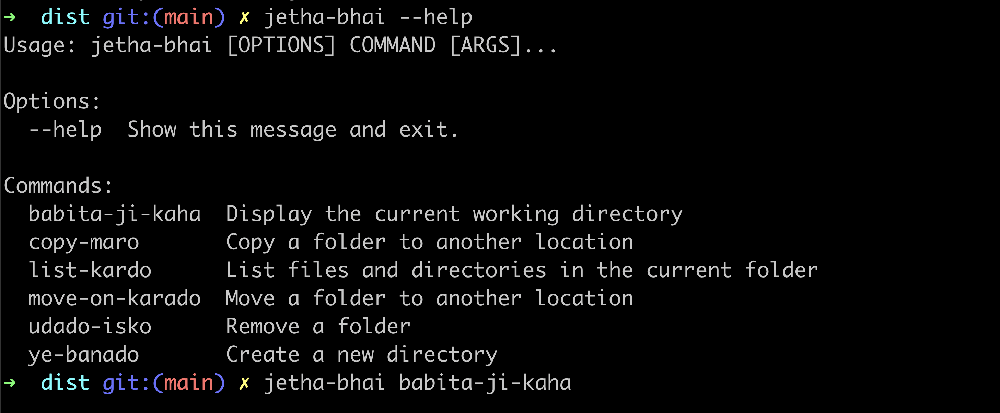

# Jetha-Bhai CLI

Jetha-Bhai CLI is a command-line interface that provides a fun and unique way to interact with your file system. It mimics some common shell commands, but with a twist. Each command is translated into the language of Jetha-Bhai, a popular character from Indian television.



## Installation

```bash
pip install jetha-cli
```

# Test Cmd

```bash
jetha-bhai --help
jetha-bhai ye-banado f1
jetha-bhai list-kardo
```

## Table

| command     | jetha-cli                       |
| ----------- | ------------------------------- |
| pwd         | jetha-bhai babita-ji-kaha       |
| ls          | jetha-bhai list-kardo           |
| mkdir c1    | jetha-bdhai ye-banado c1        |
| mv f1 c2    | jetha-bhai move-on-karado f1 c2 |
| rm -rf f1   | jetha-bhai udado-isko f1        |
| cp -r f1 f2 | jetha-bhai copy-maro f1 f2      |

# Thank you
